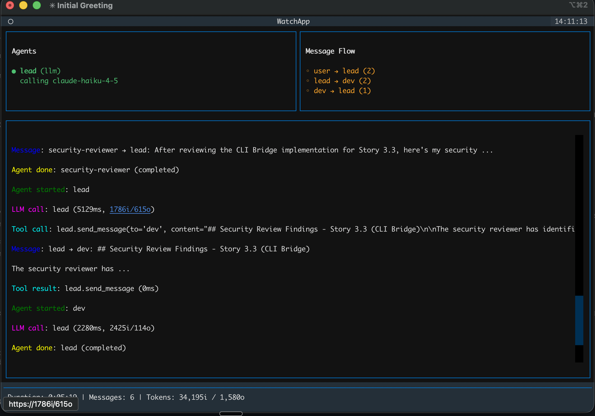

# Lattice

Declarative multi-agent orchestration CLI. Define agent teams in YAML, run them with `lattice up`, observe with `lattice watch`, debug with `lattice replay`.



## Install

```bash
uv pip install lattice-cli
```

## Usage

```bash
lattice --help
lattice init          # scaffold a starter config
lattice up            # run a session
lattice down          # remote-shutdown a running session
lattice watch         # live TUI for the active session
lattice replay <id>   # replay a recorded session
```

## Session Recording

Every `lattice up` session is recorded to an append-only JSONL file under `sessions/`. Each line is a typed event with a monotonic sequence number and ISO 8601 timestamp:

| Event type        | Description                                  |
|-------------------|----------------------------------------------|
| `session_start`   | Session identity, team name, config hash     |
| `session_end`     | Reason, duration, aggregate token usage      |
| `message`         | Inter-agent message (from, to, content)      |
| `llm_call_start`  | LLM call begins (model, message count)       |
| `llm_call_end`    | LLM call completes (tokens, duration)        |
| `tool_call`       | Tool invocation (tool name, arguments)       |
| `tool_result`     | Tool return (duration, result size)           |
| `status`          | Free-form agent status (e.g. "waiting for…") |
| `error`           | Error with retry flag                        |
| `agent_start`     | Agent begins execution                       |
| `agent_done`      | Agent finishes (with reason)                 |
| `loop_boundary`   | Loop iteration start/end marker              |
| `cli_text_chunk`  | Streaming text from a CLI agent              |
| `cli_tool_call`   | Tool call from a CLI agent                   |
| `cli_thinking`    | Internal thinking from a CLI agent           |
| `cli_progress`    | Progress status from a CLI agent             |

A verbose sidecar file (`*.verbose.jsonl`) stores full tool results matched by sequence number, keeping the primary log compact.

## Watch

`lattice watch` opens a live Textual TUI that tails the active session's JSONL file. It shows:

- **Agents panel** — each agent's current state (active, standby, waiting, errored) and what it's doing right now
- **Messages panel** — real-time inter-agent message flow with sender/receiver labels
- **Events panel** — scrolling log of all session events (LLM calls, messages, errors)
- **Session stats** — token usage, message count, duration, loop iteration

Tool call events are hidden by default to keep the event feed readable. Use `-v` to show them on startup, or press `t` to toggle visibility live.

| Key | Action              |
|-----|---------------------|
| `t` | Toggle tool calls   |
| `q` | Quit                |

The TUI works in two modes: standalone (`lattice watch`) which finds the latest session in `sessions/`, and combined mode (`lattice up --watch`) which embeds the TUI directly into the session runner. Both modes tail the same JSONL file and render identically.

## Replay

`lattice replay <session-id>` opens a post-hoc session debugger TUI. It loads a completed (or in-progress) JSONL session file and lets you step through events one at a time:

| Key          | Action                                          |
|--------------|-------------------------------------------------|
| `j` / `Down` | Next event                                      |
| `k` / `Up`   | Previous event                                  |
| `g`          | Jump to a specific event by sequence number     |
| `/`          | Search/filter events by text                    |
| `a`          | Filter by agent name                            |
| `t`          | Filter by event type                            |
| `c`          | Clear all filters                               |
| `q`          | Quit                                            |

The detail view shows the full JSON payload for the selected event, and the session summary at the top displays metadata (team, duration, token totals).

Session files are the only input — no API keys or running processes needed. You can replay any session from any machine as long as you have the JSONL file.

## Development

```bash
uv sync
uv run lattice --help
uv run pytest tests -v
uv run ruff check .
uv run mypy src
```
